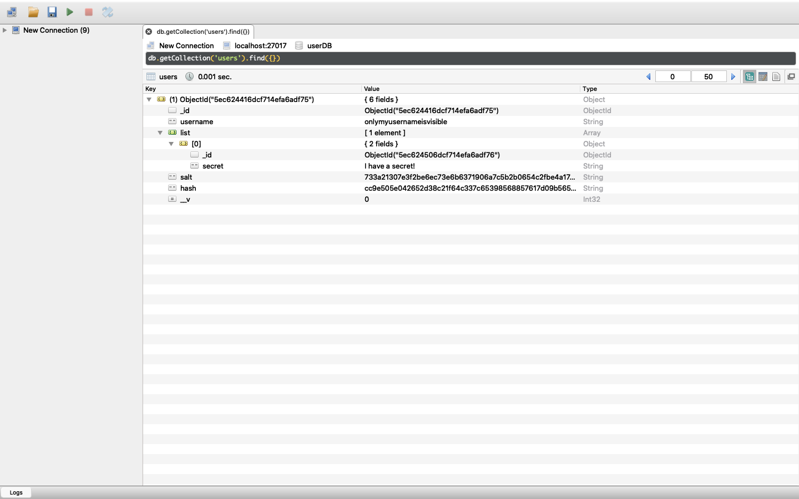

## Secrets
Anonymously share a secret by sharing it on this app. Only logged in members can see the secrets displayed!

## About the App
This web application saves secrets and member usernames, email addresses and passwords to a secured mongoose database.
It uses passport-local, passport-local-mongoose and passport-google-oauth20 for secure authentication and session support, and also uses bcrypt to salt and hash users' email addresses within the database.

## How to Use
Install dependencies from package-lock.json by cloning this repository and running npm install in its directory.

Obtain OAuth 2.0 client credentials from the Google API Console at https://console.developers.google.com/

Create a .env file with a secret encryption key of your choice and your Google credentials:
```txt
SECRET=
GOOGLE_CLIENT_ID=
GOOGLE_CLIENT_SECRET=
```

Connect locally to MongoDB. See https://docs.mongodb.com/manual/administration/install-community/

Run Node.js server and open http://localhost:3000 to view app in the browser.

## App Screenshots


## Database Screenshots 
All important information is hidden:

